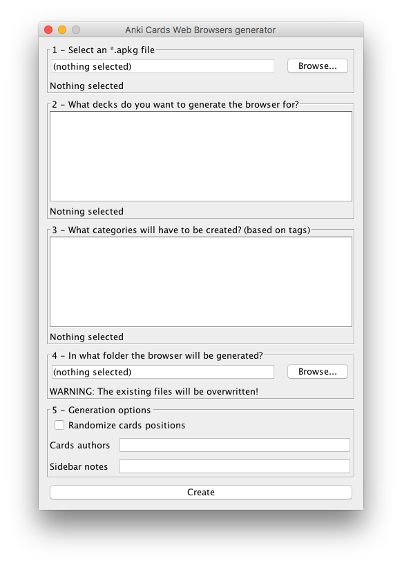

# Anki Cards Web Browser
## What is this?
> Anki Cards Web Browser is a tool that converts apkg archives into static web sites.

[Here](https://slavetto.github.io/primo-anno/) You can find an example of some exported decks.
 
 
## When should you use this ?
Did you put hours or days to create hundreds of anki card for your decks and now you want to share your work with other
friends? Great! this should be easy, you just need to export the .apkg file and upload it somewhere, send the link to
your friends and then explain to them how to import all the decks in Anki! Oh, and don't forget to tell them that they
also need to install Anki, create an account to synchronize the cards ...
 
Anki Cards Web Browser let you share all your cards easily, generating a single folder that you can host, upload or
share and then just open the index.html file. Your friends won't be able to enjoy all the amazing Anki features, but
maybe they will understand the power of Anki or at least they will use your card!
 
## How can i use this?
You can download the latest available release [here](https://github.com/slavetto/anki-cards-web-browser/releases) which
is a jar file that you can launch double clicking it. Remember that you need the [Java 8](http://www.oracle.com/technetwork/java/javase/downloads/jre8-downloads-2133155.html)
installed on your system. If your system doesn't recognize the jar file, you can launch it using:
 
```sh
java -jar cards-browser-release-1.0.jar
```
 
When the interface is shown, just select the exported .apkg file from Anki, select the decks and the categories you want
to export and specify the destination folder for the static web site that will be generated.
If you prefer, you can also randomize the cards, specify the author of the deck and add notes that will appear in the
left sidebar.
 


 
If instead you’re a developer and want to build the tool from the source code, clone this repository and open the
project with IntelliJ IDEA. To build the tool, let’s first have a look at the project structure:
 
## Project Structure
If you open the project with IntelliJ IDEA you will notice that there are 3 modules.
* [documentation](https://github.com/slavetto/anki-cards-web-browser/blob/master/documentation/Processing%20Anki's%20.apkg%20files.md): Contains a document written in markdown that explains the .apkg file structure;
* [cards-browser](https://github.com/slavetto/anki-cards-web-browser/tree/master/cards-browser): This module is the Java program that read the .apkg file and convert it into a json file and a folder
with the card’s images (also the latex expression are converted into images). Gradle takes care of the project
dependencies and the jar building;
* [html](https://github.com/slavetto/anki-cards-web-browser/tree/master/html): This module contains the source of a [Vue.js](https://vuejs.org/)
app that loads a file named ‘decks.json’ and display the web interface. To build the web app [Webpack](https://webpack.github.io/)
with the [vue-loader](https://github.com/vuejs/vue-loader) component is used;
 
If you want to build the tool from source you first need to generate the web app build.js file and then copy it with the
index.html file in the project_root/cards-browser/src/main/resources/data folder. There is a file named
'static-files-list' which contain a list of static files that will be copied in the export folder.
The project already contains the latest web app build so you can check the file structure.

Once you have build the web app just launch the project with IntelliJ or build the jar with:
```sh
cd cards-browser
gradle clean
gradle releaseJar
```
(assuming that you're in the project root).
You'll find the built jar in project_root/cards-browser/build/libs/